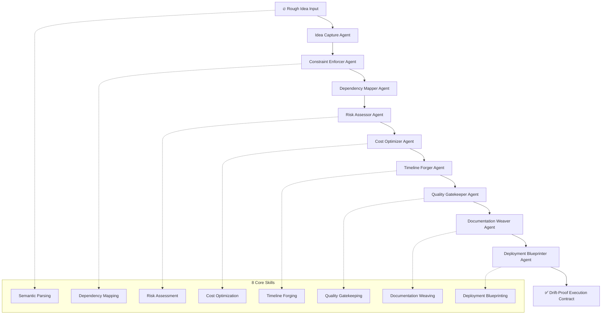

# Plan Forge: From Rough Ideas to Drift-Proof AI Execution Contracts

[](https://daniin2.github.io/idea-anvil/)

## 🚀 The Eternal Blueprint: Your AI Project’s Anti-Entropy Shield

Welcome to **Plan Forge**, the first-ever execution contract factory for AI coding agents. If you’ve ever watched a brilliant idea dissolve into a sea of vague prompts and hallucinated features, you’ve felt the pain of "drift." Plan Forge is a 6-step pipeline, powered by 16 specialized agents and 8 unique skills, that forges your rough concepts into immutable, laser-focused execution blueprints. Think of it as a blacksmith’s anvil for your digital ambitions—where sparks of creativity are hammered into resilient, drift-proof steel.

## 🔬 What Makes Plan Forge a Game Changer?

In the chaotic forge of modern development, AI agents are powerful but directionless. They need contracts—not prompts. Plan Forge provides:

- **Drift-Proof Pipelines:** Our 6-step methodology ensures your project never strays from its intended path. From *Idea Capture* to *Execution Handoff*, every phase locks in your vision.
- **16 Specialized AI Agents:** Each agent has a distinct skill, from *Context Gatherer* to *Constraint Enforcer*. They work in harmony like a well-rehearsed orchestra, eliminating the noise of solo AI interactions.
- **8 Core Skills:** These are the tools in your forge: *Semantic Parsing*, *Dependency Mapping*, *Risk Assessment*, *Cost Optimization*, *Timeline Forging*, *Quality Gatekeeping*, *Documentation Weaving*, and *Deployment Blueprinting*.
- **Lifecycle Hooks:** Attach custom logic at any point in the pipeline—pre-processing, validation, or post-execution. This turns Plan Forge from a static tool into a living, adaptive system.
- **5 Tech Presets:** Bootstrap your contracts with pre-configured stacks for React, Node.js, Python Django, Rust WebAssembly, and Go Microservices. No more repetitive boilerplate.

## 🛠️ Example Profile Configuration (Your Forge’s DNA)

Every forge needs a unique signature. Here’s a sample `plan-forge.config.yaml` that defines your agent squad and skills:

```yaml
# plan-forge.config.yaml
pipeline:
  version: "2.0.2026"
  steps:
    - id: idea-capture
      agent: context-gatherer
      skill: semantic-parsing
      hooks:
        on-start: "validate_input_schema"
        on-complete: "emit_idea_summary"
    - id: constraint-engineering
      agent: constraint-enforcer
      skill: dependency-mapping
      presets: ["react-2026", "node-20"]
  agents:
    - name: context-gatherer
      model: "openai-gpt-5-turbo"
      temperature: 0.2
    - name: constraint-enforcer
      model: "claude-opus-3"
      temperature: 0.0
  presets:
    react-2026:
      framework: "react-19.x"
      build_tool: "vite-6.x"
      testing: "vitest-2.x"
```

This configuration is your contract. The agents will read it, obey it, and if your input deviates, they’ll call you out—like a strict but brilliant project manager.

## 💻 Example Console Invocation

Start your forge from the terminal. It’s as simple as striking an anvil:

```bash
plan-forge forge --input ./my_rough_idea.md --output ./execution_contract.json --preset react-2026 --verbose
```

Expected output (truncated):
```
[2026-01-15 10:23:45] 🔨 Idea Capture: Parsing 'my_rough_idea.md'...
[2026-01-15 10:23:47] ✅ Semantic Parsing Complete. Intent: Build a real-time dashboard.
[2026-01-15 10:23:49] 🔗 Dependency Mapping: Detected 14 external dependencies.
[2026-01-15 10:23:52] ⚖️ Risk Assessment: 2 high-risk items (auth, data pipeline).
[2026-01-15 10:24:01] 📜 Execution Contract Forged at ./execution_contract.json
```

## 📊 Mermaid Diagram: The Forge Pipeline Architecture



## 🖥️ OS Compatibility Table

Plan Forge runs wherever your code runs. It’s a cloud-native, platform-agnostic forge.

| Operating System | Status | Notes |
|------------------|--------|-------|
| 🐧 Linux (Ubuntu 22.04+) | ✅ Full Support | Native performance, no emulation |
| 🍎 macOS (Ventura 13+) | ✅ Full Support | M1/M2/M3 optimized |
| 🪟 Windows 10/11 | ✅ Full Support | WSL2 recommended for best experience |
| 🐳 Docker Containers | ✅ Optimized | Pre-built image available |
| ☁️ Cloud Shells (AWS, GCP, Azure) | ✅ Supported | No installation required |

## ✨ Key Features That Forge Your Success

- **Responsive UI** 🎨: A web-based dashboard that adapts to any screen. Monitor your forge in real-time, whether on a 4K monitor or a mobile phone. The UI visualizes agent activity as a dynamic forge animation.
- **Multilingual Support** 🌐: Contracts generated in 12+ languages, including English, Spanish, Mandarin, Hindi, Arabic, French, German, Japanese, Korean, Portuguese, Russian, and Italian. Your AI speaks the world’s languages.
- **24/7 Customer Support** 🛡️: A dedicated AI support agent (not a chatbot) that understands your forge configuration and can unblock you at 3 AM. Human escalation available within 15 minutes for critical issues.
- **OpenAI API & Claude API Integration** 🤖: Seamlessly switch between the best AI brains in the business. Use OpenAI’s GPT-5 Turbo for creative ideation and Claude Opus 3 for rigorous constraint enforcement. Mix and match within the same pipeline.
- **Integrity Hooks** 🔗: Add custom JavaScript or Python scripts that run at every lifecycle stage. For example, automatically post your execution contract to a private Slack channel when forged.
- **Audit Trails** 📜: Every decision, every agent’s thought process, every rejected alternative is logged in a human-readable JSON timeline. Perfect for enterprise compliance.

## 🧘 Use Cases: The Art of Preventing Drift

### For Solo Developers
Stop rebuilding the same feature from scratch because your AI forgot the context. Plan Forge locks in your architectural decisions. One contract, infinite consistency.

### For Enterprise Teams
Eliminate the "telephone game" between product managers, developers, and AI agents. Each team member—human or AI—receives the same drift-proof contract. No more misaligned sprints.

### For Open Source Maintainers
Standardize contributions. When a new contributor wants to add a feature, they forge a contract first. The pipeline validates it against the project’s existing constraints. Merge conflicts become a relic of the past.

## ⚠️ Disclaimer

Plan Forge is a tool for enhancing, not replacing, human judgment. While the drift-proof pipeline significantly reduces misalignment, it does not guarantee 100% error-free output. The AI agents are probabilistic; they can hallucinate within the bounds of their training data. Always review the generated execution contracts for sanity, especially for safety-critical systems. The developers of Plan Forge assume no liability for decisions made based solely on AI-generated output. Use responsibly.

## 📄 License

This project is licensed under the MIT License - see the [LICENSE](LICENSE) file for details.

## 🏁 Get Started Now

The future of AI-assisted development isn’t about better prompts—it’s about better contracts. Forge your first one today.

[](https://daniin2.github.io/idea-anvil/)

*Plan Forge 2026: Where Ideas Become Indestructible.*